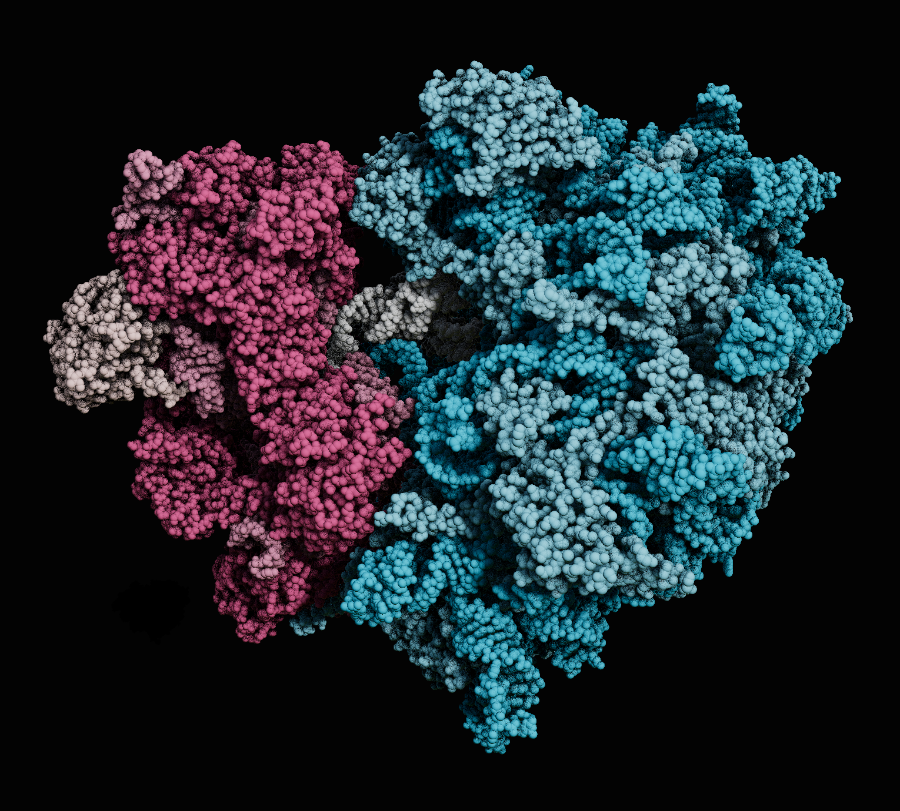



Jump inside a living cell, on your iPad, and see how mRNA vaccines work at a molecular level. Coming soon to the iOS App Store. 



  

Follow our development on twitter:



 <!--  background:
    video:
      path: teaser.mp4
    image_darken: 0.6
    #  Options are `cover` (default), `contain`, or `actual` size.
    image_size: cover
    # Options include `left`, `center` (default), or `right`.
    image_position: center
    # Use a fun parallax-like fixed background effect on desktop? true/false
    image_parallax: true
    # Text color (true=light, false=dark, or remove for the dynamic theme color).
    text_color_light: true -->