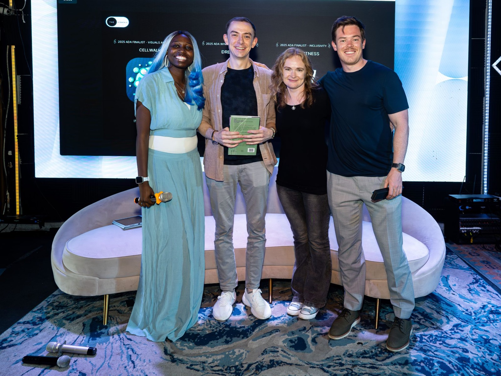

I joined fellow Apple Design Awards 2025 winners and finalists on stage for *The Interface* at WWDC25, a curated fireside chat series hosted by UX designer Tamia James. The panel brought together CellWalk (Visuals and Graphics finalist), DREDGE (Interaction winner), and Train Fitness (Inclusivity finalist) to share the stories, craft, and decisions behind the work.

